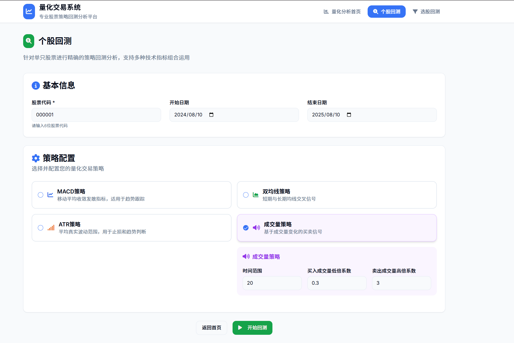
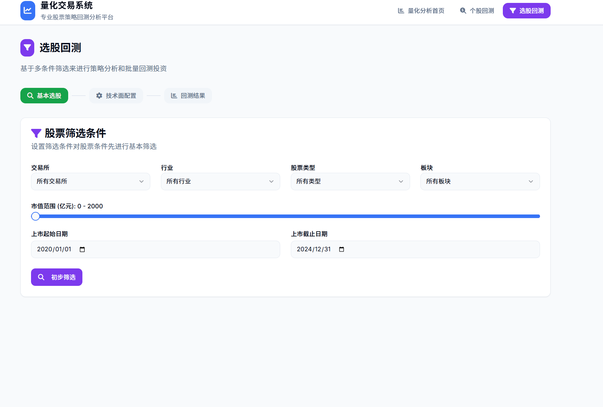
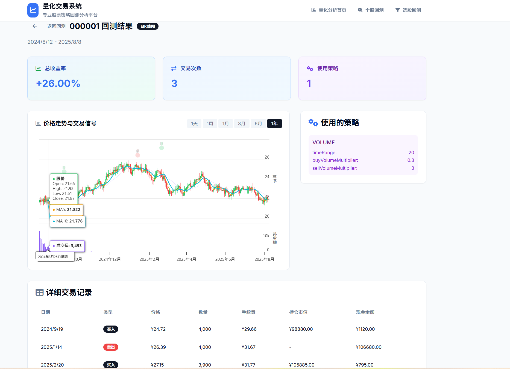

# TradingLab 🧪⚡
**当金融遇上极客精神，量化交易从此变成一场高能实验！**  
[](https://opensource.org/licenses/MIT)
[](https://www.python.org/)
[](https://reactjs.org/)
[](https://fastapi.tiangolo.com/)

> *“在 TradingLab，没有'韭菜'，只有尚未完成实验的交易研究员。”*  
> —— 实验室墙上的涂鸦

---


## 🌟 核心亮点
- 📊 **可视化实验室**：一键生成专业级回测报告，收益率，交易记录，价格走势与信号图表一目了然；
- 🌐 **全市场覆盖**：内置数据提取器，可通过多个数据源获取需要的股票数据；
- 🧪 **策略实验室**：5+经典策略模板（动量、均值回归、套利等），开箱即用！


## 🚀 5分钟极速安装

### 系统要求
- [Python 3.13+](https://www.python.org/)
- [uv](https://github.com/astral-sh/uv)
- [Node.js 23.2.0+](https://nodejs.org/)
- [SQLite (内置)](https://sqlite.org/)

### 后端安装启动
```bash
# 克隆实验室仓库
git clone https://github.com/souloss/TradingLab.git
cd TradingLab

# 安装前端和后端依赖
make run-backend

# 运行
make run-backend
```

### 🧪 使用
主页：


单股策略回测：


多股策略回测：


回测结果：


### 📚 实验手册

#### 快速开始：你的第一个策略
- 在 backend/tradingapi/strategy 下定义你的技术指标和买卖策略；
- 通过 fetcher 抓取真正的交易数据；
- 验证你的策略！

<div align="center">
**TradingLab** - 让量化交易成为一场激动人心的科学实验！
</div>